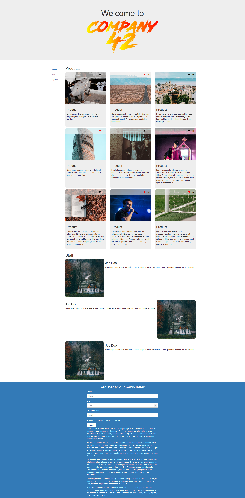
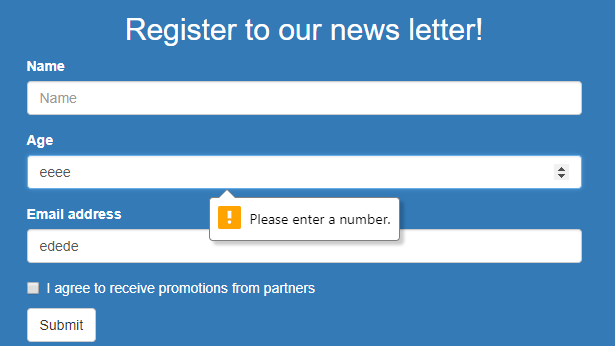
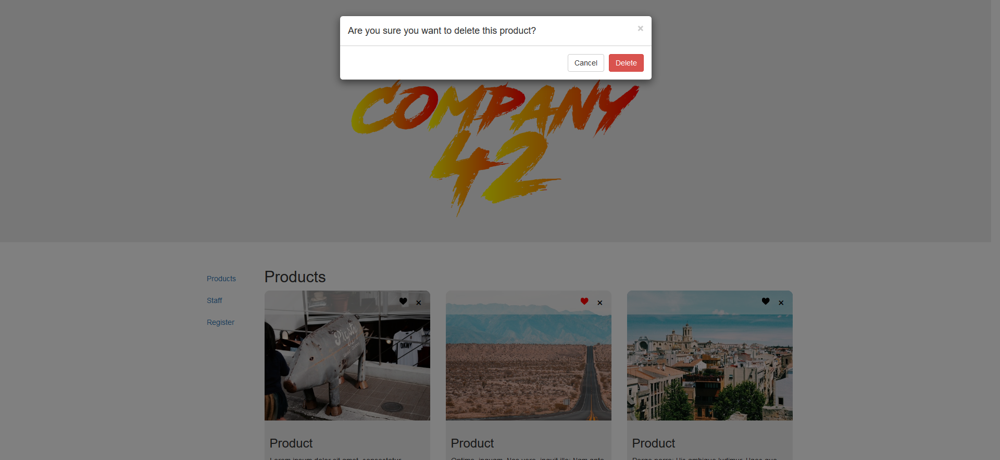
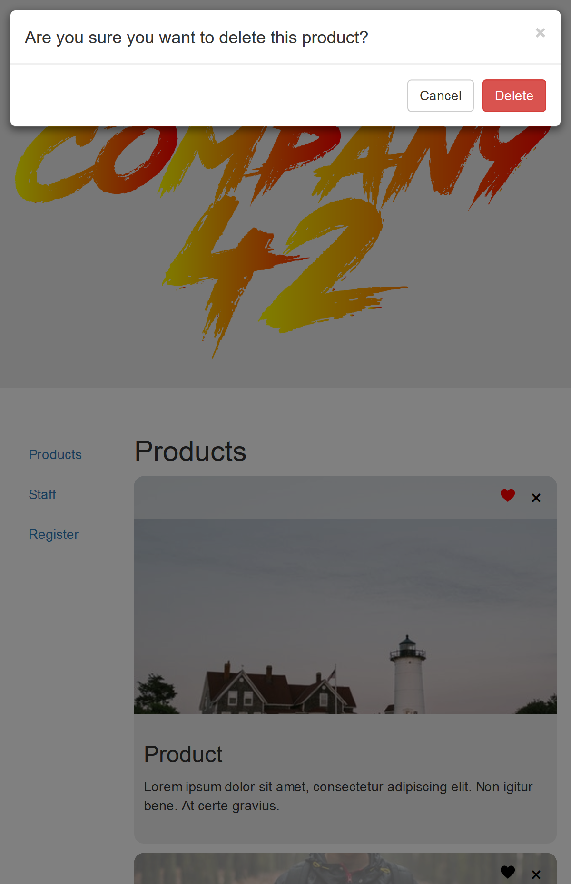

# Dam Digital Front End Developer Technical Challenge
The purpose of this technical challenge is to get a feel for the current skill level of candidates applying for a front end developer job with Dam Digital.

-------

## Task
We would like you to demonstrate your development skills by delivering a solution to a short set of requirements listed below.

- We don't expect you to spend any longer than 2/3 hours on this task.
- Once you have finished, please send us a link to your zipped code or even better a link to your solution in a hosted Git repository (GitHub / BitBucket etc.).
- You may also wish to include some handover notes along with your code.

As part of the recruitment process we would like you to discuss your solution, the approach you've taken and any challenges you faced.

If you have any questions, please get in touch.

------

## Background 

Company 42 have contacted Dam Digital to help them finish a prototype their website. They want Dam Digital to help them fixed a number of bugs and to create 2 new blocks in this page.

The website must support the following browsers:

- Chrome (latest version)
- Firefox (latest version)
- Internet Explorer (IE 11+)
- Android
- IOS 

------

## Designs
All designs are in the design folder.

------

Desktop design

Tablet design

Mobile design

Form validation design

Modal design

## Bugs to fix

Some of these bugs are browser specific. In the event you do not have access to the necessary browser (e.g. if you are working on a apple device you won't have access to Internet Explorer) 
please give us potential solutions to these bugs.

### Bug 1 - The page is not scaling correctly on mobile or tablet devices
The whole website looks off on mobile and tablet - everything is really small.
When resizing the window on desktop everything works fine.
The website should look as per the mobile and tablet designs.

### Bug 2 - Logo does not appear in the header
The designs show that we are supposed to have a logo in the header, we can see that the logo is in the markup but this one isn't displayed.
The logo should be shown.

### Bug 3 - Heart icon should change color on click
When clicking on the heart icon in any of the cards the colour should change from black to red to indicate to the user that this product has been added to their favorite products.

### Bug 4 - User should be able to delete cards
When clicking on the cross icon in the card a modal should appear (as per design) and the user should be able to click on 'delete' to remove this card.

### Bug 5 - Cards should be the same height as per design
Currently not all cards have the same height. We would like the cards to take the height of the largest one in each row. Not all rows need to be the same height.

### Bug 6 The side navigation shouldn't be displayed for screens under 480px
The side navigation should only be displayed on screens equal to or above this breakpoint.

### Bug 7 - Links in the side navigation do not work
When clicking on the side navigation links the user should be taken to the correct section.

### Bug 8 - Website is broken on IE11
When viewing the site in IE11 it isn't displaying correctly.

## Blocks Creation

The page is missing two blocks

- Staff block
  - See design
  - 

- Register to newsletter in footer
  - See design
  - This block should follow basic HTML validation from the browser (see validation design)
  - 
  - 
